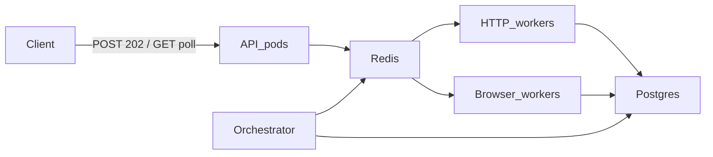
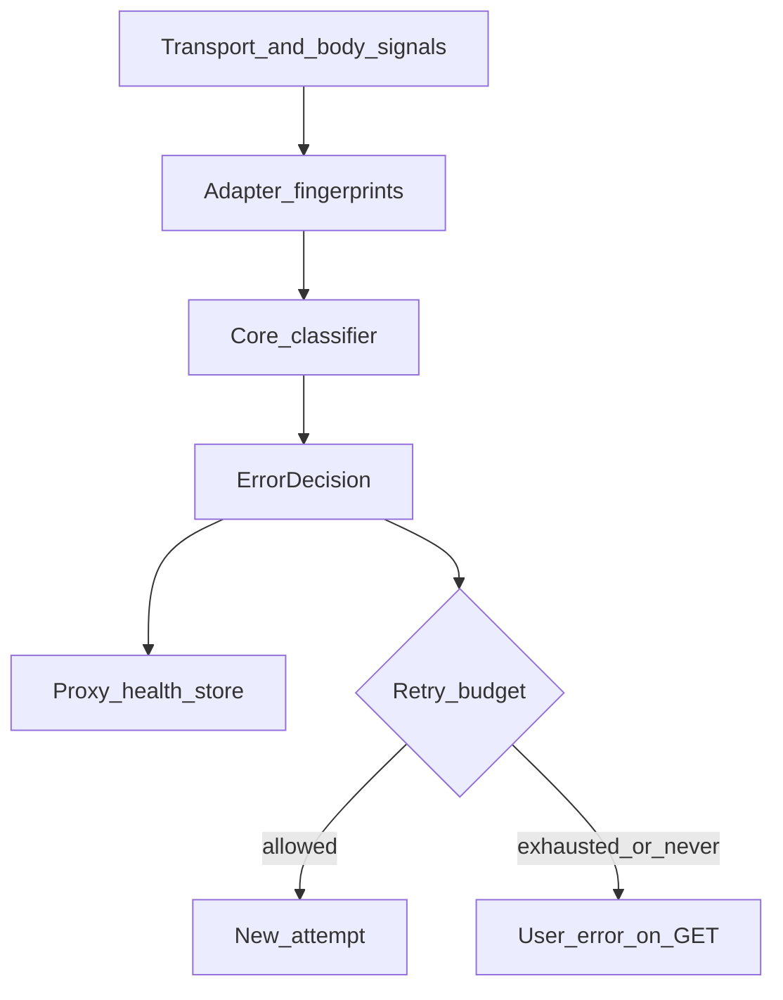

# LLM Web Query Service — System Design

This file **is** the planning-phase document. All architecture decisions live here. Cursor plan files are working notes only; if they disagree with this file, this file wins.

This is the architecture for a NestJS API that takes a prompt, a consumer LLM website (`chatgpt` / `gemini` for now), an optional geo, and a parse flag, then returns a normalized result. It hits the **consumer websites**, not official LLM APIs. **Guest-only, permanently** — we never log into the targets.

**Build target (locked):** production-shaped from day one — Redis queues, **Postgres** for the static proxy pool (and users later), separate HTTP and browser worker **runtimes**. Not a later rewrite of an in-process prototype.

## 1. High-level: components, data, code

One async query flows through these pieces. Nothing else needs to exist for v1.



| Piece | Role |
|---|---|
| **API** | NestJS. Validates, writes a `queued` query, returns 202. Polls Redis for `GET /v1/queries/:id`. No LLM I/O, no browsers. |
| **Postgres** | Durable store. v1: **static proxy pool** (inventory + per-target health/burn). Later: **users** / API keys. The pool is rows you insert, not discovered at runtime. |
| **Redis** | Ephemeral: BullMQ queues, query result TTL (~15 min). |
| **Orchestrator** | Asks the adapter for an `ExecutionPlan`, leases a proxy from Postgres, enqueues work, runs `ErrorDecision` (health written back to Postgres), writes `ok` or `error` to Redis. |
| **Adapters** | Gemini / ChatGPT: plan, parse, classify, and **step implementations**. Adding a later LLM is a new adapter package + registry line. |
| **HTTP workers** | Thin runtime: fetch, proxy, timeouts. Loads only steps tagged `http`. Cheap, many replicas. |
| **Browser workers** | Thin runtime: Playwright headless Firefox, proxy, concurrency cap. Loads only steps tagged `browser`. Expensive, few replicas. |

Gemini never occupies a browser slot in v1. ChatGPT never occupies an HTTP worker in v1.

**Guest-only, permanently.** No passwords, OAuth, or imported personal cookies toward chatgpt.com / gemini.google.com. There is no `signed_out` flag and no future “logged-in adapter mode.” If a later site cannot be used as a guest, that source is `TARGET_UNAVAILABLE` / out of product scope — we do not add login.

### 1.1 Data stores

Two stores. Do not put the static proxy list in Redis (a flush would forget the pool and burns).

#### Postgres (durable)

**proxies** — the static pool (you insert/update rows; the system does not invent proxies):

- `id`, `url` (or host/port), `auth_secret_ref` (not the raw password in git)
- `geo` (ISO country), `kind` (residential | datacenter | egress-gateway | local-test)
- `mode` (`stateless` | `stateful`)
- `enabled`

**proxy_health** — per `(proxy_id, target)` so a ChatGPT burn does not retire a Gemini IP:

- `score`, `consecutive_failures`, `cooldown_until`, `burned_until`
- unique `(proxy_id, target)`

**Lease** — column on `proxies` (`leased_until`, `lease_request_id`) with `SELECT … FOR UPDATE SKIP LOCKED`, or a small `proxy_leases` table. Prefer Postgres so “in use” survives a Redis restart. The pool is small and static; row locks are enough.

**users** (not v1, same database later): accounts / API keys. Auth seam already exists; tables wait until we build the user system.

Test `LOCAL` egress is a `kind = local-test` row, not a separate code path that bypasses the table.

#### Redis (ephemeral)

**Query** (`query:{request_id}`, TTL ~15 min) — poll payload: status, prompt echo, result or error, timings.

**Job** (BullMQ payload, one per plan step; v1 = one job per query) — `request_id`, `step_id`, `source`, `worker`, `lease_id`, `timeout_ms`, `artifacts`.

**Session / conversation** (`conversation:{id}`, TTL ~15 min, same order as query TTL) — turn history + adapter `target_session` artifacts for follow-ups. Sticky IP may also pin via Postgres when `affinity: session`.

Queues: `llm-queue-http`, `llm-queue-browser`.

### 1.2 Code layout

Step **implementations** live in the adapter that owns the plan. Worker apps are thin **runtimes**: they do not contain Gemini/ChatGPT site logic.

```
apps/api/                      POST 202, GET poll, validation, auth seam
apps/worker-http/              runtime only: fetch, proxy, timeouts; loads http-tagged steps
apps/worker-browser/           runtime only: Playwright Firefox, proxy, cap; loads browser-tagged steps
packages/types/                QueryCommand, ExecutionPlan, Step, ErrorDecision, ProxyLease
packages/adapters-gemini/
  plan, parse, classify
  steps/generate.http.ts       GET /app + StreamGenerate (one v1 step)
packages/adapters-chatgpt/
  plan, parse, classify
  steps/generate.browser.ts    full guest turn
packages/orchestrator/         runs plans: lease → enqueue steps → ErrorDecision
packages/errors/               core classifier + public codes
packages/proxy/                Postgres pool, lease, health
packages/queue/                Redis / BullMQ
```

A later hybrid adapter adds `steps/mint.browser.ts` and `steps/spend.http.ts` in **that same folder**. HTTP workers pick up `spend`; browser workers pick up `mint`. Updating a plan means editing one adapter package.

**Worker composition (locked):** not a runtime filesystem walk (fragile for Nest/webpack/Docker). Each adapter **exports** its steps with `worker: "http" | "browser"`. `worker-http` imports the registry filtered to `http` only; `worker-browser` imports `browser` only.

**Hard rule:** the HTTP worker image must not import Playwright (or ChatGPT browser step modules). The browser worker must not be the place we put Gemini URLs. Explicit registry + split step files keep the graphs separate.

Compose: `api`, `worker-http`, `worker-browser`, `redis`, **`postgres`**. Test `LOCAL` is a `local-test` proxy row.

**Why `ExecutionPlan` lives in `packages/types`, not in `packages/orchestrator`:** the orchestrator is not the only consumer.

- Adapters **build** a plan (`plan()` returns `ExecutionPlan`).
- Orchestrator **runs** the plan (lease, enqueue each step).
- Workers **receive one `Step`** as the Redis job payload.

If the type lived only inside the orchestrator package, Gemini/ChatGPT would import the orchestrator. The orchestrator already **registers** those adapters. That is a circular dependency. A leaf `packages/types` breaks the cycle. The **runner** stays in the orchestrator; the **contract** stays in types.

## 2. Goal

A caller submits one query (async) and, when it completes, gets back at minimum:

| Field | Meaning |
|---|---|
| original prompt | Echo of the request |
| source / target used | Which site served it (`chatgpt`, `gemini`, …) |
| generated response as plain text | The answer, not a challenge page |
| request status | Success or a typed error |
| request ID | Unique ID for this call |
| execution duration | End-to-end time on our side |

If the target actually provides them (never invented):

| Field | Meaning |
|---|---|
| markdown representation | Answer with formatting preserved |
| citations | Structured citation objects |
| citation URLs | Deduped URL list |
| model information | Id / display name if present in the payload |

`parse` (locked):

- `true` (default) — normalized answer fields only (minimum contract + optional extras we actually found).
- `false` — same minimum contract, plus a **structured JSON dump** of everything we recognized and any leftover blobs. Not the literal wire bytes.

## 3. Constraints

- Consumer sites only. No OpenAI / Gemini / Anthropic APIs. No third-party “LLM scraper” products.
- **Guest-only forever** toward targets. No login, OAuth, or personal cookies. No planned logged-in mode.
- **Production egress is proxy-only.** No pod-IP / direct egress on live traffic, even when `geo_location` is omitted.
- **Test/dev** may use a local/direct path (config flag). Same lease/health/classifier APIs; test is a backend, not a bypass.
- `geo_location` is first-class. **No silent geo substitution:** explicit geo with no healthy proxy → `GEO_UNAVAILABLE`.
- Locale is always **en-US** in v1 (not derived from geo).
- **Multi-turn conversations are supported.** Omit `conversation_id` to start a new chat; pass a prior `conversation_id` to send a follow-up in the same chat (same `source`). Guest-only still applies — we hold target session artifacts server-side, never user logins.
- No inbound user/API-key system yet. Leave a middleware seam; accounts come later.
- Typed errors, bounded retries, backoff, timeouts, concurrency limits.
- Scale-out is a **deployment** concern (more HTTP pods, more browser pods, more proxies), not a code rewrite.

## 4. What the POCs actually proved

These are facts the adapters must honor. They are **not** a promise that the sites will keep behaving this way.

### Gemini (`gemini.google.com`) — HTTP-capable today

- Guest generate worked **without a browser** from the research IP.
- Flow: `GET /app` → read `f.sid` + `bl` from page bootstrap → `POST StreamGenerate`.
- Live values needed per session: the two HTML bootstrap ids. Dummy attestation still worked in that test; cookies were not required on the POST.
- Response is a streamed JSON-ish body. Plain text, conversation ids, and a model id were present. Citations / markdown: not confirmed as a stable schema.
- **Implication:** Gemini v1 is **one HTTP step** (bootstrap + generate inside `adapters-gemini`). Stateless proxies are fine. If BotGuard/WAA later requires a browser, that is a new **step file in the same adapter**, not login and not a new system.

### ChatGPT (`chatgpt.com`) — JS-gated; v1 is headless Firefox full-send

| Method | Result |
|---|---|
| Pure HTTP (cookies only, no JS mint) | Failed the verification gate |
| Vanilla **headless Chromium** | Cloudflare challenge / 403 — **not a working path** |
| **Headed Chromium**, full turn | Worked (guest `hello` → greeting) |
| Browser mint + HTTP spend once, same machine | Worked; identical replay failed (one-shot tokens) |
| **Headless Firefox (Playwright) full send** | Worked. Bench 2026-08-28: mean **4.84s**, ~1013 MB Firefox RSS |
| Headless Firefox mint + one HTTP spend | Worked. Same bench: mean **5.40s**, ~1011 MB. HTTP POST alone **1.7–2.0s** (cold TLS) |

Bench (3+3 interleaved, all 6 got a real greeting): full-send is **~0.56s faster** (~12%). RAM is the **same** because mint still launches Firefox. Shared cost dominates: browser start + page + Sentinel.

**Chosen ChatGPT path:** one `browser/generate` step in `adapters-chatgpt`, run by the Playwright Firefox **runtime**. Not hybrid. Not headless Chromium.

Hybrid stays an **execution-plan option** for a future target (mint + spend step files in that adapter). It is not ChatGPT v1.

## 5. Design principles

1. **Adapters own site quirks and step implementations. The core owns jobs, proxies, worker runtimes, errors, and the public schema.**
2. **Declare execution needs, don’t hard-code them in the orchestrator.** Each adapter returns an `ExecutionPlan`. v1 plans have **one step**; the type still allows many.
3. **Resource pools scale independently.** HTTP runtimes, browser runtimes, and proxy inventory are separate capacities.
4. **Treat proxies as perishable.** Health, cooldown, and burn are first-class.
5. **Split from day one.** Redis queues + Postgres proxy inventory + two worker deployments. The API is stateless.
6. **Never report a block page as an LLM answer.** Classification happens before parse.
7. **No silent geo fallback.** Wrong country is a failed request, not a surprise success.
8. **The orchestrator never guesses on failure.** It executes an `ErrorDecision`.
9. **Guest-only is product scope**, not a per-adapter toggle.

## 6. Public API (locked: style B)

Async from day one. Sync POST-and-wait and “sync now, async later” were rejected: browser jobs and typical gateway idle timeouts (30–60s) fight a waiting POST. Webhooks can be added later on the same result record; **v1 is poll-only**.

### Submit

`POST /v1/queries` → **202**

```json
{
  "request_id": "q_01J…",
  "status": "queued"
}
```

### Poll

`GET /v1/queries/:id`

Job states: `queued` | `running` | `ok` | `error` | `expired`.

While in-flight, return `{ request_id, status }`. When terminal, include the success or error body below. Unknown id → 404. Past Redis TTL → `expired`.

API pods only **enqueue and read results**. They do not hold the client for the LLM turn.

### Request body

```json
{
  "source": "gemini",
  "prompt": "What are the three largest countries in Europe by population?",
  "parse": true,
  "geo_location": "US",
  "conversation_id": "conv_01J…"
}
```

| Field | Required | Notes |
|---|---|---|
| `source` | yes | Registry key. v1: `chatgpt` \| `gemini`. Unknown → `UNSUPPORTED_SOURCE`. |
| `prompt` | yes | Non-empty string. Max **8192** characters. |
| `parse` | no | Default **true**. |
| `geo_location` | no | ISO 3166-1 alpha-2. If set and no healthy proxy in that geo → `GEO_UNAVAILABLE`. Never substitute another country. If omitted in production → a healthy proxy from the **default pool** (still a proxy). |
| `conversation_id` | no | Omit to start a **new** chat. Set to continue an existing conversation (must match `source`). Unknown / expired / source mismatch → `CONVERSATION_NOT_FOUND`. |

Locale is always `en-US` (not derived from geo). Success bodies always include `conversation_id` so the client can follow up.

Limits (v1): global deadline **60–120s**; **2** internal retries (see §10).

### Success body (normalized)

Always present (minimum contract):

```json
{
  "request_id": "q_01J…",
  "status": "ok",
  "duration_ms": 4120,
  "source": "gemini",
  "prompt": "…",
  "parse": true,
  "geo_location": "US",
  "conversation_id": "conv_01J…",
  "response_text": "…"
}
```

`conversation_id` is always set on success (new or continued). Pass it on the next POST to continue the same chat.

When `parse: true` and discovered:

```json
{
  "markdown": "…",
  "citations": [{ "title": "…", "url": "https://…" }],
  "citation_urls": ["https://…"],
  "model": { "id": "cf41b0e0dd7d53e5", "name": "Gemini 2.5 Flash-Lite" }
}
```

When `parse: false`, also include `payload`: a structured object, **not** raw bytes — recognized fields plus leftover blobs as opaque JSON. Optional extras are **omitted** when unknown. Do not send fake `null`s.

### Error body (always specific)

Returned on `GET` when `status` is `error` (and mirrored in the result record):

```json
{
  "request_id": "q_01J…",
  "status": "error",
  "duration_ms": 800,
  "source": "chatgpt",
  "prompt": "…",
  "error": {
    "code": "TARGET_BLOCKED",
    "message": "The target returned a block or challenge instead of an answer.",
    "http_status": 403,
    "retryable": false,
    "retry_after_ms": null
  }
}
```

`retryable` is **for the caller** (whether *they* should POST again), not our internal proxy rotation. After we already rotated and exhausted budget, `retryable` is false even if the class was “retry with a new IP.”

Do not return proxy id, lease id, raw challenge HTML, or tokens.

| Code | Typical HTTP | Meaning |
|---|---|---|
| `INVALID_REQUEST` | 400 | Bad body (empty/too-long prompt, bad types). |
| `UNSUPPORTED_SOURCE` | 400 | `source` not in the registry. |
| `GEO_UNAVAILABLE` | 422 | Explicit geo has no healthy proxy. Ours; not in the original assignment list. |
| `CONVERSATION_NOT_FOUND` | 404 | `conversation_id` unknown, expired, or `source` mismatch. |
| `TARGET_RATE_LIMITED` | 429 | Target 429 / Retry-After after our internal retries. |
| `TARGET_BLOCKED` | 403 | Block, ban, or challenge page — never treated as an answer. |
| `TARGET_TIMEOUT` | 504 | Target or our deadline ran out. |
| `TARGET_UNAVAILABLE` | 503 | Target down, worker queue past deadline, default pool empty. |
| `PARSING_FAILED` | 502 | We got a body that looked like a response but could not meet the contract. |
| `EMPTY_RESPONSE` | 502 | Finished stream / page with no assistant text. |
| `INTERNAL_ERROR` | 500 | Our bug. |

Prefer this enum plus a **specific `message`**. `QUEUE_SATURATED` folds into `TARGET_UNAVAILABLE`.

Auth: none in v1. A user/API-key system is later **in this same Postgres**; leave middleware that can reject `401` without touching adapters.

## 7. Scale knobs (production split)

```
API pods (stateless)  →  Redis (queues, query TTL)
                      →  Postgres (proxies, health, leases; users later)
                      →  HTTP worker runtimes
                      →  Browser worker runtimes
```

| Knob | What you add |
|---|---|
| More Gemini QPS | HTTP worker replicas |
| More ChatGPT QPS | Browser worker replicas |
| More geos / IPs | Insert proxy rows in Postgres |
| More API clients | API replicas |

No adapter changes for those knobs. Gemini volume never buys Firefox.

## 8. Core abstractions

### 8.1 Source adapter

```
SourceAdapter
  id: string
  capabilities(): Capabilities
  plan(input: QueryCommand, ctx: PlanContext): ExecutionPlan
  parse(raw: RawCapture, opts: { parse: boolean }): ParsedResult
  classify(failure: TransportFailure | RawCapture): ErrorDecision
```

Steps are **exported from the same package**, tagged `http` | `browser`. Not listed as a “login vs guest” capability.

| Capability | Gemini | ChatGPT v1 |
|---|---|---|
| `worker_kinds` | `http` | `browser` |
| `proxy_affinity` | `none` | `none` (one browser step, one lease) |
| `hybrid_handoff` | no | **no** (future option only) |
| `parse_fields` | text, model id, conversation id, … | text, plus whatever the page/partial yields |

The orchestrator never contains `if (source === 'gemini')`.

### 8.2 Execution plan

The orchestrator still executes `ExecutionPlan.steps[]` so a future hybrid target can be two jobs without a rewrite. **Do not** enqueue two jobs for today’s adapters (wasted Redis hops and worker scheduling).

```
ExecutionPlan
  affinity: "none" | "request" | "session"
  session_key?: string
  steps: Step[]

Step
  id: string
  worker: "http" | "browser"
  purpose: "generate" | "mint" | "other"
  timeout_ms: number
  uses_session: boolean
```

**Gemini v1 — one step:** `http/generate` in `adapters-gemini/steps/generate.http.ts` (GET `/app` + POST StreamGenerate in that file). HTTP runtime just runs it.

**ChatGPT v1 — one step:** `browser/generate` in `adapters-chatgpt/steps/generate.browser.ts`. Browser runtime (Playwright Firefox) just runs it.

`affinity` for both v1 plans: `none` (one step, one lease for that job). `request` / `session` remain on the type for later targets.

**Future hybrid** (not ChatGPT v1): `browser/mint` then `http/generate` on the same P (`affinity: request`), both step files in that adapter.

**Future session-sticky target:** `affinity: session` + `session_key`. Can live as a Postgres column; Redis is optional cache.

### 8.3 Proxy / egress lease manager

The pool is **static Postgres rows**, not “a URL in env” and not a Redis hash.

See §1.1 for `proxies`, `proxy_health`, and lease via `SELECT … FOR UPDATE SKIP LOCKED`. Health is **per `(proxy_id, target)`**. Burns survive a Redis flush.

| Affinity | Meaning |
|---|---|
| `none` (stateless) | Any healthy proxy in that geo / default pool; prefer a different one on retry. Gemini v1. |
| `request` (stateful for one job) | One proxy held for every step. Required for future hybrid across pods. |
| `session` | Pin `session_key` to an egress until TTL/burn. |

**Production:** every job acquires a real proxy lease from Postgres. Omitted `geo_location` → healthy proxy from the default pool. Explicit geo with none healthy → `GEO_UNAVAILABLE`. If the default pool is empty/burned → `TARGET_UNAVAILABLE`.

**Test/dev:** a `kind = local-test` row (gated by config). Classification, retries, and user error codes still run.

### 8.4 Worker deployments (runtimes)

| Deployment | Runs | Scales with |
|---|---|---|
| `api` | Validate, 202 enqueue, GET poll | client QPS |
| `worker-http` | Generic HTTP runtime + registered `http` steps | Gemini (and future HTTP spend) |
| `worker-browser` | Playwright Firefox runtime + registered `browser` steps | ChatGPT concurrency |

Rules:

- `worker: browser` never runs on an HTTP pod.
- `worker: http` never boots a browser.
- Future hybrid jobs share `lease_id` in the Redis payload so both pods egress through the same proxy.
- Each pool has a concurrency cap (browser cap is small; Redis or in-process limiter).
- Queue wait past the deadline → `TARGET_UNAVAILABLE`.

v1 browser image: Playwright Firefox. Headless Chromium is not the ChatGPT runtime.

## 9. Request lifecycle

1. Validate → `INVALID_REQUEST` / `UNSUPPORTED_SOURCE`; else mint `request_id`, write `queued`, return **202**.
2. Resolve adapter; `plan()` (v1: one step).
3. `acquire(geo, affinity, source)` → `GEO_UNAVAILABLE` / `TARGET_UNAVAILABLE` if no lease.
4. Enqueue that step; status `running`.
5. Matching worker runtime loads the adapter’s step implementation; runs through the leased proxy; writes artifacts.
6. Enqueue further steps only if the plan has them (not Gemini/ChatGPT v1).
7. `classify` **before** `parse`. On failure, execute `ErrorDecision`.
8. On success: `lease.release(success)`; write `ok` result.
9. Client polls `GET /v1/queries/:id` until terminal or TTL `expired`.

Timeouts: per-step **and** a global deadline (60–120s). Deadline wins over retry budget.

## 10. Error handling (core module)

The orchestrator does not ad-hoc `if (status === 403)`. Every failure becomes an `ErrorDecision`. Classification always runs **before** parse. A 200 “verify you are human” page is never `response_text`.



### 10.1 ErrorDecision (internal)

| Field | Meaning |
|---|---|
| `code` | Public typed code (§6) |
| `message` | Specific, safe (no cookies, tokens, proxy URLs) |
| `http_status` | Status we expose on the error object |
| `retry` | `never` \| `same_lease` \| `new_proxy` \| `restart_plan` |
| `proxy_action` | `none` \| `neutral` \| `cooldown` \| `burn` \| `success_signal` |
| `retry_after_ms` | From `Retry-After` or our backoff |
| `fingerprint` | Internal match id for logs/tests — **not** returned to the caller |

### 10.2 Who classifies what

**Core / transport:** DNS, TLS, timeouts, connection reset, HTTP 429/503, empty body, queue deadline, no healthy proxy, browser pool saturated.

**Adapter:** 200-with-challenge, ChatGPT verification-gate copy, Cloudflare interstitial, Gemini missing bootstrap ids / empty stream, “answer-looking” HTML that is actually a block page.

### 10.3 Signal → retry → proxy action → user code

Internal retries: **2**, exponential backoff with jitter, global deadline wins. Sticky affinity never rotates mid-plan unless the adapter says artifacts are invalid on a new IP.

| Signal | `retry` | `proxy_action` | User `code` when giving up |
|---|---|---|---|
| Validation / unknown source | `never` | `none` | `INVALID_REQUEST` / `UNSUPPORTED_SOURCE` |
| Explicit geo, no healthy proxy | `never` | `none` | `GEO_UNAVAILABLE` |
| Default/prod pool empty or all burned | `never` | `none` | `TARGET_UNAVAILABLE` |
| Model-slow timeout or one empty stream | `same_lease` once | `neutral` | `TARGET_TIMEOUT` / `EMPTY_RESPONSE` |
| 429 / Retry-After | `new_proxy` if `affinity: none`, else backoff `same_lease` | `cooldown` | `TARGET_RATE_LIMITED` |
| Soft block / challenge | `new_proxy` | `cooldown`, or `burn` after N consecutive on `(proxy, target)` | `TARGET_BLOCKED` |
| Hard ban fingerprint | `new_proxy` if another healthy IP exists | **`burn` immediately** | `TARGET_BLOCKED` (do not leak proxy identity) |
| Parse failure after a real-looking body | `never` | `neutral` | `PARSING_FAILED` |
| Worker queue past deadline | `never` | `none` | `TARGET_UNAVAILABLE` |

Never infinite retry. Never treat internal proxy rotation as `retryable: true` on the final user body.

### 10.4 Proxy health (minimize burned IPs)

Per `(proxy_id, target)`:

- **EWMA score** (0–1): success up, block/rate-limit down.
- **Cooldown** after soft block / 429 (minutes, growing).
- **Burn** after hard-ban fingerprint or N consecutive blocks (hours, or until manual unstick).
- **Selection:** weighted random among eligible proxies in that geo / default pool. Exclude cooldown, burned, and sticky-leased. Prefer high score. Never pick the worst IP “to use it up.”
- **Spread** when `affinity: none` so one good IP does not draw a target-side rate limit.
- **Optional later:** idle cheap GET through the proxy to detect dead endpoints without an LLM turn.

`ErrorDecision.proxy_action` writes this to **Postgres** `proxy_health`. Timeouts are weaker signals → `neutral`, not burn. All replicas see burns because they share the same database.

### 10.5 Concurrency

- API: enqueue + poll reads.
- HTTP pool: relatively wide.
- Browser pool: **hard cap** (small). Excess waits until deadline then `TARGET_UNAVAILABLE`.
- Per-proxy: max 1 sticky lease; stateless may allow a small concurrent cap per IP.

## 11. Scalability (no revamp)

| Growth | Action |
|---|---|
| More Gemini traffic | Replica `worker-http` |
| More ChatGPT traffic | Replica `worker-browser` |
| New geo | Insert proxies with that `geo` tag; health rows start neutral |
| New LLM | New adapter package (plan + step files); register steps on the matching worker runtime |
| IP-bound / hybrid future LLM | Adapter sets `affinity: request` or `session`; add step files in that adapter |
| API traffic | Replica `api` |

## 12. Parse behavior (locked)

Default if omitted: **true**.

| `parse` | Top-level | Extra |
|---|---|---|
| `true` | `response_text` + discovered markdown/citations/model | no `payload` |
| `false` | still `response_text` (minimum contract) | `payload`: recognized fields + opaque leftovers |

`payload` is JSON we built from the capture, not a base64 wire dump.

## 13. Security / hygiene

- No official LLM API keys.
- No target-site login, ever. Guest only.
- No inbound auth in v1; do not log future API keys.
- One-shot tokens (if a future hybrid path uses them) live in Redis artifacts for the job TTL only, never logged in full.
- Do not log cookies, BotGuard blobs, or Sentinel tokens.
- Proxy credentials in secrets, not git.
- Error responses never include proxy identity or challenge HTML.

## 14. Open questions

Leftovers are operational defaults, not architecture forks:

| ID | Question | Current lean |
|---|---|---|
| Q14 | Queue wait vs immediate reject when the browser pool is full? | Wait until deadline, then `TARGET_UNAVAILABLE` |
| Q17 | Query result TTL 15 min vs longer? | Redis **15 min** for poll. Proxies stay in Postgres. |

## 15. Decision log

| Date | Decision |
|---|---|
| 2026-08-26 | Both targets from day one; network-first, browser as fallback; proxies intended later |
| 2026-08-27 | Gemini guest generate works HTTP-only in research conditions |
| 2026-08-27 | ChatGPT: HTTP-only fails; headless Chromium challenged; headed full turn works; same-IP mint then HTTP spend works once |
| 2026-08-28 | This file is the planning document |
| 2026-08-28 | **Q1** production-split (Redis queues + Postgres proxies + split worker pods) |
| 2026-08-28 | **Q2** API style **B**: POST 202 + poll GET; webhooks later |
| 2026-08-28 | **Q3** `parse: false` = structured recognized dump + leftovers |
| 2026-08-28 | **Q4** ChatGPT v1 = Playwright **headless Firefox full-send**; hybrid demoted |
| 2026-08-28 | **Q5 / Q16** no silent geo fallback; production **proxy-only**; omitted geo → default proxy pool; test may use LOCAL/direct |
| 2026-08-28 | **Q6** `geo_location` = ISO 3166-1 alpha-2 |
| 2026-08-28 | **Q7** (superseded 2026-08-29) originally no follow-ups |
| 2026-08-29 | **Q7′** multi-turn via optional `conversation_id`; session store + `affinity: session` when continuing |
| 2026-08-28 | **Q8** prompt 8k; global 60–120s; 2 internal retries |
| 2026-08-28 | **Q9** no inbound auth now; user system later; middleware seam |
| 2026-08-28 | **Q11** locale always **en-US** |
| 2026-08-28 | **Q12** default `parse` = true |
| 2026-08-28 | **Q18** ChatGPT browser image = Playwright headless Firefox |
| 2026-08-28 | Error handling is a first-class `ErrorDecision` pipeline |
| 2026-08-28 | Guest-only is **permanent**; no `signed_out` capability; no login path |
| 2026-08-28 | Gemini and ChatGPT v1 = **one step each**; multi-step type kept for later |
| 2026-08-28 | `ExecutionPlan` in `packages/types` (avoid adapter ↔ orchestrator cycle) |
| 2026-08-28 | Step implementations live in adapter packages; workers are thin runtimes + explicit step registry |
| 2026-08-28 | **Postgres** for static proxy inventory + health + leases; **Redis** for queues and query TTL; **users later** in the same Postgres |
